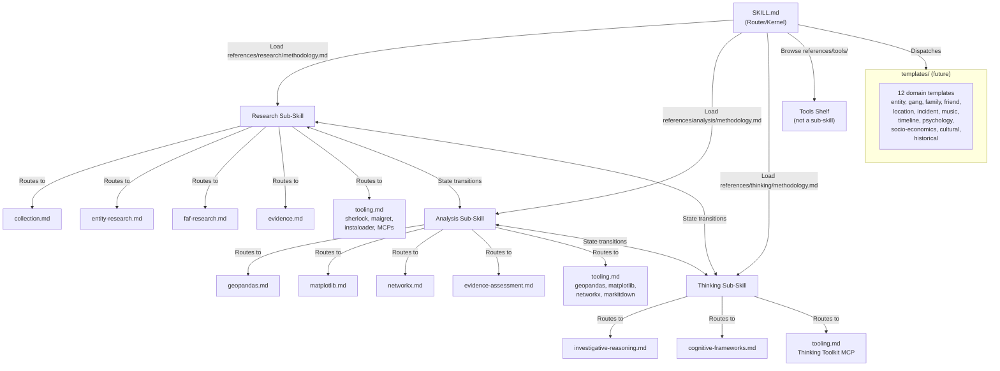

# Plan: References Consolidation

**Label:** references-consolidation
**Created:** 2026-03-30
**Status:** draft

---

## Objective

Consolidate all four `/references/` subdirectories from 64 files of frankensteined source material into clean, domain-correct reference documents that support a state-machine investigation workflow. Extract template-worthy content for later domain-specific template creation.

## Principles

1. **State machine, not pipeline.** The investigation moves between states (research, analysis, thinking) freely. References must support any-order access.
2. **Each folder is a sub-skill.** Each references folder is its own skill — with its own identity, constraints, methodology, reference routing, examples, and constraints reminder. The `methodology.md` in each folder IS the skill file (without YAML header). The parent SKILL.md is the kernel/router dispatching into these sub-skills based on investigation state.
   - `references/research/methodology.md` = the Research sub-skill
   - `references/analysis/methodology.md` = the Analysis sub-skill
   - `references/thinking/methodology.md` = the Thinking sub-skill
   - `references/tools/` = browsable shelf (not a sub-skill)
3. **Best bits extraction.** Every source file is audited for its best content. Good content goes to the right reference file in the right sub-skill. Template-worthy content is flagged for later template creation. Junk is dropped.
4. **Tool awareness per state.** Each sub-skill folder gets a `tooling.md` listing which setup.py dependencies, MCPs, and scripts apply in that state.
5. **Templates come after.** The domain template list (entity, gang, family, friend, location, incident, music/media, timeline, psychology, socio-economics, cultural-background, historical-context) informs what references need to support, but templates are a separate task.
6. **Conversational workflow.** Templates will be lightweight quick-fire cards for use in conversation, not deep research prompts. References are the knowledge backing them.
7. **SAVVY applies to sub-skill files.** Each methodology.md follows the SAVVY structure: identity in primacy zone, constraints, methodology with reference routing, examples in recency zone, constraints reminder at the end. They are skill files in all but packaging.

---

## Architecture

The parent SKILL.md is a router/kernel. Each references folder is a self-contained sub-skill with its own identity, constraints, methodology, reference files, and tooling. The investigation state machine transitions between sub-skills.



Each `methodology.md` follows the SAVVY skill structure:

```
<identity>        ← primacy zone: who you are in this state
<constraints>     ← rules for this state
<methodology>     ← how to work, reference routing, transition conditions
<examples>        ← recency zone: good behaviour in this state
<constraints_reminder> ← recency zone: verify before responding
```

---

## Current State

### references/research/ (25 files)

**Source domains mixed together:**

| Source Domain | Files | Quality | Notes |
|---|---|---|---|
| Drill-adapted investigation (claudian build) | research-and-evidence.md, search-and-collection.md, osint-methodology.md | HIGH | Already domain-adapted. Core material. |
| CLES/AI research handbook | ai-research-handbook-blueprint.md | HIGH | Structural framework for master file. 4-tier architecture, 8-part decision structure per method. |
| Genealogy/family history | research-strategies.md, research-plan-guidance.md, evidence-evaluation.md, gps-guidelines.md, citation-templates.md, family-friends-research.md | MEDIUM | FAN Principle maps to gang network investigation. GPS is a solid evidence framework. Needs stripping and adapting. |
| Generic agentic research prompts | research_process.md, research_subprocess.md | LOW | OODA loop pattern is useful. Everything else is generic system prompt material. |
| Platform extraction/OSINT ops | platforms.md, content-extraction.md, extraction-guide.md, scan-methodology.md, social-media-intelligence.md, web-scraping-cascade.md, fact-check-workflow.md, profile.md | MEDIUM | Operational how-to. Overlaps heavily across files. |
| IQTS tools | IQTS-Evidence_Log-Tool.md, IQTS-Investigation_Plan-Tool.md, IQTS-Note_to_File-Tool.md | MEDIUM | UNESCO SBI structured templates. Operational use. |
| Sherlock data | sherlock-removed-sites.md (1,997 lines) | LOW | Reference data for the sherlock tool. Not a reference document. |

### references/analysis/ (30 files)

| Category | Files | Belongs Here? |
|---|---|---|
| Geopandas API docs (7 files) | geopandas.md + 6 sub-files | YES — data analysis tool |
| Matplotlib API docs (5 files) | matplotlib.md + 4 sub-files | YES — data analysis tool |
| NetworkX API docs (6 files) | networkx.md + 5 sub-files | YES — data analysis tool |
| MarkItDown (1 file) | markitdown.md | YES — document processing |
| IQTS evidence tools (3 files) | Chain_of_Custody, Evidence_Evaluation_Matrix, Table_of_Findings | YES — structured evidence assessment |
| Investigative reasoning (4 files) | investigative-reasoning.md, pigeon-mechanics.md, source-verification.md, psychoprofile.md | NO — thinking/ material |
| Investigation workflows (4 files) | dossier.md, leads.md, network.md, timeline.md | NO — investigation activities spanning multiple states |

### references/thinking/ (5 files)

| File | Content | Notes |
|---|---|---|
| theoretical-foundation.md | Spurious regularities across learning systems | Strong. Academic foundation for pigeon mechanics. |
| debiasing-protocols.md | Evidence-based cognitive debiasing | Strong. 190 lines, well-structured. |
| hypothesis-generation.md | 8-step hypothesis workflow | Good. References Scholar Gateway, Consensus, Exa MCPs (need updating). |
| scqa_framework.md | McKinsey SCQA structured thinking | Medium. Generic business framework. Parts useful. |
| first_principles.md | First principles thinking | Medium. Generic. Some useful patterns. |

### references/tools/ (4 files)

| File | Content | Verdict |
|---|---|---|
| analysis-tools.md (2,475L) | Scraped GitHub awesome-list about code linters | JUNK — not relevant to investigation |
| data-engineering-tools.md (367L) | Scraped data engineering handbook README | JUNK — not relevant |
| research-tools.md (798L) | Scraped awesome-list of research tools | LOW — generic, some useful links |
| mcp-reference.md (6L) | 6 bare MCP URLs | KEEP — needs expanding into proper docs |

---

## Target State

### references/research/ (6 files)

| Target File | Sources (best bits from) | Content |
|---|---|---|
| `methodology.md` | ai-research-handbook-blueprint.md, research_process.md (OODA pattern only), research_subprocess.md (budget pattern only) | **Research sub-skill file.** Identity: what research is (finding and gathering information). Constraints: rules for the research state. Methodology: investigation types, research question formation, scope management, search order, when to transition to analysis or thinking. Reference routing: which file to load for which research task. Examples: good research behaviour. Constraints reminder. Written using SAVVY structure. Adapted from the CLES 4-tier/8-part framework. |
| `collection.md` | search-and-collection.md, scan-methodology.md, web-scraping-cascade.md, content-extraction.md, extraction-guide.md, platforms.md, social-media-intelligence.md | Platform-agnostic then platform-specific gathering. Search order (registry → primary → news). Reddit, Twitter, Instagram, YouTube, court records, FOI. How to use each MCP for collection. |
| `entity-research.md` | osint-methodology.md (individual/gang/location profiling), profile.md, research-and-evidence.md (hypothesis sections) | Primary subject investigation. Identity, digital footprint, geo, assets. How to build profiles for individuals, gangs, locations. |
| `faf-research.md` | family-friends-research.md (FAN Principle adapted), research-strategies.md (network research patterns) | Friends, associates, family. Circle mapping, relationship inference, indirect signals. FAN Principle (Family, Associates, Neighbours) adapted from genealogy to gang investigation. |
| `evidence.md` | evidence-evaluation.md (source/information/evidence classification), gps-guidelines.md (5-element proof standard adapted), citation-templates.md (citation formats), fact-check-workflow.md, research-and-evidence.md (evidence sections), research-log-guidance.md | QC, verification, logging, citation. Source classification (original/derivative/authored). Evidence assessment. Citation format. How to maintain the evidence log. |
| `tooling.md` | NEW + sherlock-removed-sites.md (as appendix/reference data) | Which setup.py deps apply in RESEARCH state: sherlock, maigret, instaloader. Which MCPs: Reddit, Twitter, Instagram, Parallel Search. Which scripts: sherlock.py, discover_artists.py, site-list.py, sites.py. How to invoke each. What they produce. |

**Dropped from research/:**
- research-plan-guidance.md — genealogy-specific planning guidance. Template-worthy bits extracted, rest dropped.
- research_process.md — generic agentic prompt. OODA pattern extracted to methodology.md, rest dropped.
- research_subprocess.md — generic subprocess prompt. Budget pattern extracted, rest dropped.
- IQTS files (3) — operational templates. Move to templates/working/ or keep in current location.

### references/analysis/ (6 files)

| Target File | Sources (best bits from) | Content |
|---|---|---|
| `methodology.md` | NEW | **Analysis sub-skill file.** Identity: what analysis is (data work, not investigation reasoning). Constraints: rules for operating in this state. Methodology: what it needs from research (profiles, evidence, raw data), what it produces (visualisations, network maps, spatial overlays, assessed evidence), when to transition back to research or into thinking. Reference routing: which file to load for which task. Examples: good analysis behaviour. Constraints reminder. Written using SAVVY structure. |
| `geopandas.md` | geopandas.md + geopandas-crs-management.md + geopandas-data-io.md + geopandas-data-structures.md + geopandas-geometric-operations.md + geopandas-spatial-analysis.md + geopandas-visualization.md | Consolidated spatial data analysis reference. All 7 files merged. Territory polygon queries, incident point analysis, proximity searches, WKT parsing. |
| `matplotlib.md` | matplotlib.md + matplotlib-api-reference.md + matplotlib-common-issues.md + matplotlib-styling-guide.md + matplotlib-types.md | Consolidated visualisation reference. All 5 files merged. Timeline plots, territory maps, incident heatmaps, network graph rendering. |
| `networkx.md` | networkx.md + networkxalgorithms.md + networkxgenerators.md + networkxgraph-basics.md + networkxio.md + networkxvisualization.md | Consolidated network/graph analysis reference. All 6 files merged. Relationship graphs, centrality analysis, community detection, gang network modelling. |
| `evidence-assessment.md` | IQTS-Chain_of_Custody-Tool.md, IQTS-Evidence_Evaluation_Matrix-Tool.md, IQTS-Table_of_Findings-Tool.md, markitdown.md | Structured evidence assessment frameworks. Chain of custody, evaluation matrices, findings tables. MarkItDown for document-to-markdown conversion during evidence processing. |
| `tooling.md` | NEW | Which setup.py deps apply in ANALYSIS state: geopandas, matplotlib, networkx, markitdown. Which MCPs: Thinking Toolkit (for analytical reasoning prompts). Which scripts: plot_template.py, content_visualizer.py, sentiment_analyzer.py, text_analyzer.py, topic_analyzer.py. How to invoke. What they produce. |

**Moved out of analysis/:**
- investigative-reasoning.md → thinking/
- pigeon-mechanics.md → thinking/
- source-verification.md → thinking/
- psychoprofile.md → thinking/
- dossier.md → thinking/ (investigation activity, not data analysis)
- leads.md → thinking/ (lead pursuit is reasoning, not data work)
- network.md → thinking/ (the workflow; networkx.md covers the tool)
- timeline.md → thinking/ (the workflow; matplotlib.md covers the plotting)

### references/thinking/ (4 files)

| Target File | Sources (best bits from) | Content |
|---|---|---|
| `methodology.md` | NEW | **Thinking sub-skill file.** Identity: what thinking is (reasoning during investigation — evaluating claims, detecting bias, generating hypotheses, assessing sources). Constraints: rules for the thinking state. Methodology: cognitive frameworks available, when to use each, how thinking interacts with research (sends back for more data) and analysis (requests spatial/network queries), investigation workflows (dossier, leads, network mapping, timeline reconstruction). Reference routing. Examples. Constraints reminder. Written using SAVVY structure. |
| `investigative-reasoning.md` | investigative-reasoning.md (from analysis/), pigeon-mechanics.md (from analysis/), source-verification.md (from analysis/), theoretical-foundation.md | Causal scoring (6-dimension pigeon risk), SIFT source verification adapted for drill journalism, wavefunction analysis for belief claims, theoretical foundation. The "how to evaluate what you're hearing" reference. |
| `cognitive-frameworks.md` | debiasing-protocols.md, hypothesis-generation.md, first_principles.md, scqa_framework.md (useful parts only), psychoprofile.md (from analysis/) | Debiasing protocols, hypothesis generation workflow, structured thinking patterns. The "how to think clearly" reference. |
| `tooling.md` | NEW | Which MCPs apply in THINKING state: Thinking Toolkit (primary — diagnose, get_technique, list_techniques). How the Thinking Toolkit maps to investigation reasoning needs. |

**Moved into thinking/ (from analysis/):**
- investigative-reasoning.md, pigeon-mechanics.md, source-verification.md, psychoprofile.md
- dossier.md, leads.md, network.md, timeline.md — these become part of methodology.md as investigation activities/workflows

### references/tools/ (unchanged + 1 update)

Leave as browsable shelf. Only change: expand mcp-reference.md from 6 bare URLs into a proper quick-reference with what each MCP exposes.

---

## Investigation Domain List (for template planning — NOT built yet)

These domains inform what the references need to support. Each will eventually become a lightweight conversational template.

| Domain | Primary State | Key Tools | What It Produces |
|---|---|---|---|
| Entity (individual) | research | Sherlock, Maigret, Instagram MCP, Reddit MCP | Individual profile |
| Gang | research + analysis | Gang knowledge base, geopandas, Reddit MCP | Gang profile with territory |
| Family member | research | Instaloader, social media analysis | Family connection profile |
| Friend/associate | research | Social media, Reddit | Associate profile + relationship mapping |
| Location/territory | analysis | Geopandas, geo CSVs, matplotlib | Territory profile with spatial data |
| Incident/event | research + thinking | Court records, news, Reddit | Incident reconstruction |
| Music/media | research + analysis | YouTube, content analysis scripts | Track analysis, video location mapping |
| Timeline | analysis + thinking | Matplotlib, evidence log | Chronological reconstruction |
| Psychology | thinking | Thinking Toolkit, psychoprofile framework | Behavioural assessment |
| Socio-economics | research | FOI, local authority records, statistics | Structural context |
| Cultural background | research + thinking | Community sources, academic sources | Cultural context profile |
| Historical context | research | Archives, court records, news archives | Historical narrative |

---

## Work Order

### Phase 1: analysis/ consolidation
Biggest folder, most misplaced content. Clearing this unblocks thinking/ (which receives files) and clarifies what analysis actually owns.

**Tasks:**
1. Move 8 files out of analysis/ to their correct homes
2. Merge geopandas × 7 → geopandas.md
3. Merge matplotlib × 5 → matplotlib.md
4. Merge networkx × 6 → networkx.md
5. Merge IQTS × 3 + markitdown → evidence-assessment.md
6. Write methodology.md (analysis master)
7. Write tooling.md (analysis deps)

### Phase 2: thinking/ consolidation
Receives files from analysis/. Small folder, high value content.

**Tasks:**
1. Receive and integrate files from analysis/
2. Merge into investigative-reasoning.md and cognitive-frameworks.md
3. Write methodology.md (thinking master)
4. Write tooling.md (thinking deps — Thinking Toolkit MCP)

### Phase 3: research/ consolidation
Biggest content extraction job. 25 files from 5+ source domains.

**Tasks:**
1. Audit every file for best bits (flag what's template-worthy)
2. Build methodology.md from CLES handbook + adapted patterns
3. Build collection.md from search/scan/extract sources
4. Build entity-research.md from OSINT + profiling sources
5. Build faf-research.md from genealogy FAN adapted + network sources
6. Build evidence.md from evaluation + GPS + citation sources
7. Write tooling.md (research deps — sherlock, maigret, instaloader, MCPs)
8. Update TickTick research checklist to match new targets

### Phase 4: tools/ cleanup
Minimal. Drop junk, expand MCP reference.

**Tasks:**
1. Remove or archive analysis-tools.md and data-engineering-tools.md
2. Expand mcp-reference.md into proper quick-reference
3. Keep research-tools.md as browsable shelf

### Phase 5: Template creation (FUTURE — not this plan)
Build lightweight conversational templates for each investigation domain. Blocked on all reference consolidation completing first.

---

## Dependencies

```
analysis/ consolidation (move misplaced files + merge tool docs + write sub-skill)
    ↓ (moves files to thinking/)
thinking/ consolidation (receive files + merge + write sub-skill)
    ↓ (both inform)
research/ consolidation (best bits extraction + write sub-skill) ←── can start audit in parallel with analysis/
    ↓
tools/ cleanup (can happen any time)
    ↓
Template creation — 12 domain templates (blocked on all sub-skills being stable)
    ↓
SKILL.md rewrite — becomes the kernel/router dispatching to 3 sub-skills (blocked on all above)
```

## Decisions Made

None yet — plan is in draft.

## Outcome

*To be completed when plan reaches status: complete or abandoned.*
