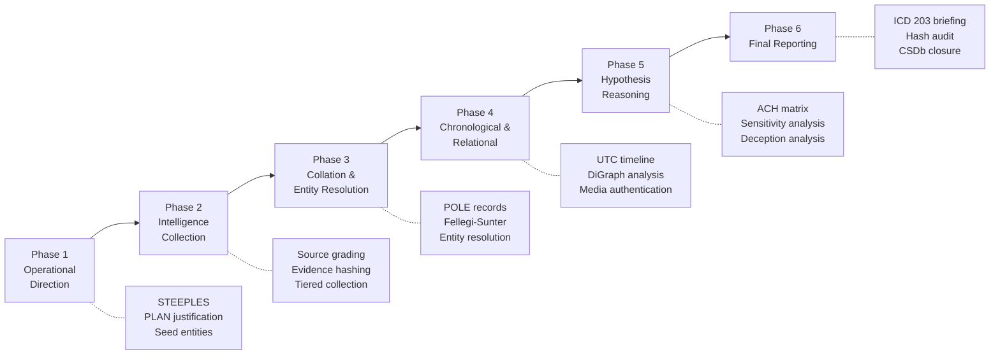

<h1 align="center">Claude Sleuth</h1>

<p align="center"><strong> Perfect for Journalists, Researchers & Private Investigators.</strong></p>

<p align="center">
  
</p>

<p align="center"><em>and yes...you. It's okay. I built the thing and I am none of those either.</em></p>

<p align="center">
  
  
  
  
</p>

---

It is 11:14 p.m., Tuesday. November, which is obvious from the condensation wrapping the edges of the glass, forming droplets and slow patterns amongst the damp Cladosporium at the bottom of the frame. The flat is in Peckham, third floor, and the only light on is the desk lamp, which throws a cone of yellow that could be mistaken for old nicotine stains, planting itself into the wall directly above the monitor. The monitor disagrees, pushing back with a cold blue of its own. Everything else besides the edges of a pair of cheekbones and the occasional puff of smoke being aspirated past the amalgamation of ugly colour is left in a particular dark. The room smells of cold coffee and something faintly organic behind it, the slow exhalation of a building at night, and Sarah has been using both to stay present for the last two hours.

Sarah Lawton is 34. She is a freelance investigative journalist, which in practice means she works alone, pays for her own PACER access, and has developed, over eleven years, a finely calibrated sense of when a set of numbers is lying to her. She is small, with close-cropped hair and the particular stillness of someone who has learned that patience is a professional skill. Her colleagues describe her as "relentless." Her editors describe her as "a nightmare to commission, impossible not to publish." She has a name on her screen, a company registration in the Cayman Islands, a beneficial owner who appears in three separate jurisdictions under two slightly different spellings, and a series of transfers that do not quite resolve.

She has been staring at this for six hours. She opens a terminal.

---

## Quick Start

### Claude Desktop, Mobile & Web

The `skills/claude-sleuth` folder is uploaded as a Claude skill. Claude reads the SKILL.md. The task runner activates.

### CLI

```bash
git clone https://github.com/elb-pr/claude-sleuth.git
cd claude-sleuth
pip install ".[all]"
python3 scripts/task_runner.py next
```

---

## The Task Runner

The terminal returns a single line. Task 1.1. Operational Direction. Before the investigation collects a single source, it requires a subject, a PLAN document, and a set of seed entities. Sarah reads it twice. She has been working this case for six hours without any of those three things formally documented. She opens a new file.

```bash
python3 scripts/task_runner.py next      # read current task and required resources
python3 scripts/task_runner.py done      # verify checklist, advance to next task
python3 scripts/task_runner.py status    # progress overview by phase
python3 scripts/task_runner.py notebook  # view the Investigation Notebook
python3 scripts/task_runner.py jump t6.2 # jump to a specific task
```

It takes her forty minutes to complete Task 1.1. She types `done`. The checklist has seven items. Five pass immediately. The sixth — PLAN justification, the formal statement of why this investigation is in the public interest — requires a rewrite. She rewrites it. The seventh passes. The task runner advances to 1.2.

---

## The Standards

By midnight she is in Phase 2, and the Admiralty scale is the first thing that slows her down.

The forum post she found at 9 p.m., the one with the account number and the name of a shell company, has no author, no date, and no corroborating link. `source_grader.py` returns it as F-6. Reliability F: the source cannot be assessed. Credibility 6: truth cannot be judged. The script does not argue. It logs the source and sets it aside. Sarah has used that post as a mental anchor for the last two hours. She deletes the note referencing it and starts again.

| Standard | Purpose |
|---|---|
| **Admiralty 6x6** | Grades source reliability (A–F) and credibility (1–6) independently before any claim enters the record |
| **ACH** | Derives conclusions via the Inconsistency Principle — surviving hypotheses have the least evidence against them |
| **ICD 203** | Maps all probabilistic language to a 7-tier scale. Vague qualifiers are not permitted |

The ICD 203 scale is the second thing that slows her down. She types "the transfers are probably linked to the holding company in Malta" and the pipeline does not accept it. Probably is not a term. She looks at the scale.

| Term | Range |
|---|---|
| Almost no chance | < 5% |
| Very unlikely | 5–20% |
| Unlikely | 20–45% |
| Roughly even chance | 45–55% |
| Likely | 55–80% |
| Very likely | 80–95% |
| Almost certain | > 95% |

She thinks about it for a moment. She types: likely. 55 to 80 percent. The pipeline accepts it.

---

## The Pipeline

Six phases. Each one contingent on the last.



<details>
<summary><strong>Phase descriptions</strong></summary>

Phase 1 is Operational Direction. The investigation defines its subject, its scope, and the conditions under which it closes. STEEPLES analysis. PLAN justification. Seed entities documented and locked. Sarah spends forty minutes on this before she is permitted to continue.

Phase 2 is Intelligence Collection. Every source is graded before its evidence enters the record. Every piece of data is hashed at the moment of capture. Sarah finds a Companies House filing from 2019 that names the beneficial owner directly. It is graded A-1. Reliability A: source is reliable, no doubt. Credibility 1: confirmed by other independent sources. The hash is logged. The chain of custody begins.

Phase 3 is Collation and Entity Resolution. By 12:30 a.m. Sarah has fourteen entity records. Two of them share a name, an address in SE5, and a company registration from 2019, but one spells the surname with a double-n and the other with one. She runs `entity_resolver.py`. The Fellegi-Sunter algorithm processes the full record and returns a match probability of 0.94. They are the same person. The record is merged. The investigation continues with thirteen entities.

Phase 4 is Chronological and Relational Processing. A UTC timeline is built from verified events. When Sarah finds a gap between March and July of 2021, she logs it as a gap. She does not fill it with inference dressed as fact. She marks it as a line of inquiry and moves on.

Phase 5 is Hypothesis Reasoning. Sarah has two hypotheses. The first: the transfers are a tax avoidance structure, aggressive but legal. The second: they are part of a sanctions evasion scheme. The ACH matrix tests each one not for what supports it but for what contradicts it. Three pieces of evidence are inconsistent with Hypothesis 1. One is inconsistent with Hypothesis 2. Hypothesis 2 survives.

Phase 6 is Final Reporting. ICD 203-compliant briefings. SHA-256 hash audit. The chain of custody is complete or the report does not leave the room.

</details>

---

## Scripts Reference

The toolkit is fifteen Python scripts.

| Script | Purpose |
|---|---|
| `task_runner.py` | Drives the 56-task pipeline (`next`, `done`, `status`, `jump`, `peek`, `notebook`, `reset`) |
| `template_builder.py` | Assembles Markdown working documents from `templates/` by phase, step, or task ID |
| `source_grader.py` | Admiralty 6x6 source reliability and credibility grading with action recommendations |
| `entity_resolver.py` | Fellegi-Sunter probabilistic record linkage; deterministic matching on unique identifiers |
| `corporate_intel.py` | Aggregates company data from UK Companies House, SEC EDGAR, GLEIF LEI, and ICIJ Offshore Leaks |
| `domain_intel.py` | Domain reconnaissance via DNS, RDAP, crt.sh, Shodan InternetDB — zero authentication required |
| `username_enum.py` | Async username enumeration across social platforms using Maigret, Sherlock, or WhatsMyName |
| `sanctions_screen.py` | Fuzzy name matching against OFAC SDN, UK HMT, and other public sanctions lists |
| `evidence_preservation.py` | Forensic web capture: screenshots, HTML, WARC, Wayback submission, SHA-256 chain of custody |
| `content_archiver.py` | Async media download and cataloguing via yt-dlp, gallery-dl, and Playwright with manifest generation |
| `chronological_matrix.py` | UTC-normalised timeline construction; gap detection, source conflict flagging, CSV export |
| `network_graph.py` | Directed POLE relationship graph; in/out-degree, PageRank, community detection, HTML/GEXF export |
| `geolocation.py` | EXIF GPS extraction, solar position/shadow analysis, historical weather correlation, reverse geocoding |
| `financial_analysis.py` | SEC EDGAR financial anomaly detection: Benford's Law, YoY variance, Altman Z-Score |
| `report_generator.py` | ICD 203-compliant briefings and findings memos via Jinja2 templates; optional WeasyPrint PDF export |

At 1 a.m. Sarah runs `financial_analysis.py` against the target company's SEC EDGAR filings. Benford's Law flags the distribution of leading digits across three years of reported transactions. The expected frequency of the digit 1 is 30.1 percent. The observed frequency is 14.3 percent. The script marks it as anomalous and logs the finding with a confidence rating. She stares at it for a long moment. Then she opens the notebook and types a new entry.

---

## Installation

Python 3.10 or higher.

### Claude Desktop, Mobile, or Web

The zip is downloaded, or the repository is cloned, and the folder is dropped into Claude.

### CLI

```bash
git clone https://github.com/elb-pr/claude-sleuth.git
cd claude-sleuth

pip install .
pip install ".[all]"
pip install ".[geo,graph,sanctions,corporate]"
```

### Via the Setup Script

```bash
python3 scripts/setup.py --modules core geo graph sanctions corporate
python3 scripts/setup.py --list
python3 scripts/setup.py --dry-run all
```

<details>
<summary><strong>Optional dependency groups</strong></summary>

| Group | Covers |
|---|---|
| `identity` | Sherlock, Maigret — username enumeration |
| `social` | yt-dlp, gallery-dl, Playwright — social media archiving |
| `network` | dnspython, ipwhois, tldextract — domain and infrastructure |
| `corporate` | edgartools — SEC EDGAR financial filings |
| `sanctions` | rapidfuzz, jellyfish — fuzzy name matching for sanctions lists |
| `geo` | geopandas, geopy, pysolar, exifread — geolocation and spatial |
| `nlp` | spaCy, NLTK, scikit-learn — entity extraction |
| `graph` | NetworkX, pyvis, Plotly — network visualisation |
| `archiving` | waybackpy, warcio, trafilatura — evidence preservation |
| `documents` | pdfplumber, pytesseract, Pillow — OCR and document handling |
| `reporting` | Jinja2, WeasyPrint, docxtpl — HTML/PDF/Word output |
| `entity_resolution` | recordlinkage — probabilistic record deduplication |

</details>

---

## MCP Servers

Three servers. Two are hosted. One is self-hosted. Server URLs go in `.claude/mcp.json`.

| Server | Purpose | Link |
|---|---|---|
| **Thinking Toolkit** | 12-technique reasoning framework. `diagnose` is called at any impasse, competing framing, or stuck point | [Smithery](https://server.smithery.ai/elbpr/thinking-toolkit) |
| **Pigeon Superstition Superposition** | 16-section Cognitive Surrogate Profiling from documentary evidence. The profile is advanced whenever subject information is synthesised | [Smithery](https://server.smithery.ai/elbpr/pigeon-superstition-superposition) |
| **CSDb** | Persistent investigation state across sessions via Cloudflare D1. Stores entities, relationships, timelines, evidence, grades, and the Investigation Notebook | Self-host via `server/` |

By 1:30 a.m. the Pigeon Superstition Superposition profile has sixteen sections. Sarah has built it entirely from public documents: company filings, a deposition transcript from 2017, a pattern of director appointments made consistently in the two weeks before quarterly reporting periods, and three interviews the subject gave to trade publications in which his description of the company's structure changed in ways that are small and specific and, she now suspects, deliberate. The profile does not require an interview. It does not require access. It requires the record, and the record is extensive.

### CSDb Self-Hosting

```bash
cd server
./setup.sh
```

CSDb stores every entity, every timeline entry, every graded source across sessions. When Sarah closes the laptop and opens it again in the morning, the investigation is exactly where she left it.

---

## Data Standards

<details>
<summary><strong>Conventions applied to all outputs</strong></summary>

Timestamps are ISO 8601, normalised to UTC.

Entity records follow the POLE schema. Mandatory fields: `source`, `date_observed`, `analyst_id`, `confidence`.

Network edges carry `source_node`, `target_node`, `relationship_type`, and `evidence_ref`. They are directed, source to target. A relationship without direction is not a relationship. It is a rumour.

Evidence is preserved with a SHA-256 hash, capture timestamp, analyst ID, and storage location, logged at the moment of capture.

Probability language is ICD 203 exclusively.

</details>

---

It is nearly 2 a.m. The mug is cold and has been cold for a long time. Sarah has not moved from the desk in three hours. On the screen: a single document, a chain of attributed findings, each one carrying a source grade, a hash, a confidence rating from a fixed scale. The forty-seven tabs are gone. The beneficial owner with two spellings of his surname is one person and always was. The gap between March and July 2021 has a label: outstanding line of inquiry, flagged for follow-up. Hypothesis 2 is alive. Hypothesis 1 is dead.

She reads the summary back. The transfers are very likely part of a sanctions evasion scheme. Very likely. 80 to 95 percent.

That is enough to go to print.
